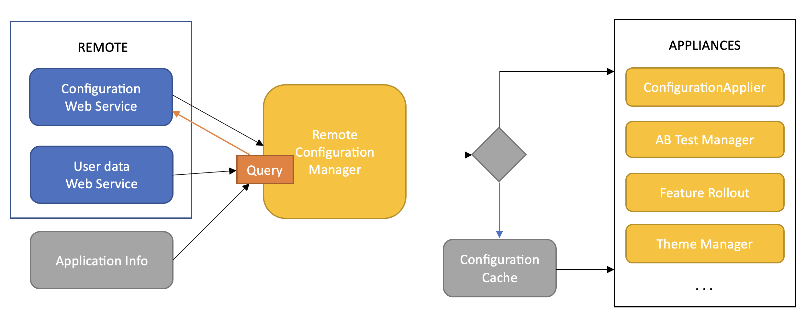

The Unity package will be designed as a Remote Configuration Manager (RCM) to interact with a web service.
This RCM will be responsible for downloading and applying configurations to the apps.
The package will be built around the principles of modularity, flexibility, and security, and would include the following components:

- Configuration Downloader: This component will be responsible for interacting with the web service to download the configuration files. It will send necessary information such as the app's version, user's account information, and other required data, and will receive the configuration file in return. This can be in a standard format such as JSON or XML.
- Configuration Applier: This component will read the downloaded configuration file and apply the changes to the app. This will include changing app behavior, modifying content, applying themes, setting up daily challenges, etc.
- Configuration Cache: This component will store the most recent configuration file locally. This will be used in case the Configuration Downloader fails to fetch a new configuration file from the server. It will also allow the app to load the most recent configuration quickly at startup.
- User Info Provider: This component will interact with the user account service to fetch required user information asynchronously.
- AB Test Manager: This component will manage A/B testing scenarios, allowing different configurations to be applied to different user groups.
- Feature Rollout Manager: This component will manage feature rollouts, allowing new features to be enabled or disabled based on the remote configuration.

Remote Configuration Manager will be used by other components of the apps, either already existing or not.
Communication can be established via direct in-editor links or, for example, a singleton architecture, where static RCM can be called by any other component.

An example of such component is Theme Manager. It is a class that can apply different aspects of configuration onto an app,
such as: interface background, font, greeting text string, music, animation. Themes can be downloadable or built-in. One of the built-in themes is default
and will be applied by Theme Manager if otherwise is not stated by RCM query results.




```csharp
class RemoteConfigManager
{
    Boolean mAutoApply = true;
    Config mConfig = null;
    
    ConfigurationDownloader mDownloader;
    ConfigurationApplier mApplier;
    ConfigurationCache mCache;
    UserInfoProvider mUserInfoProvider;
    ABTestManager mAbTestManager;
    FeatureRolloutManager mFeatureRolloutManager;

    async void Initialize()
    {
        // Get user info from remote provider
        User lUserInfo = await userInfoProvider.GetUserInfo();
        // TODO: supply default user info if this fails

        // Some component that can provide application version etc
        ApplicationVersionInfo lAppInfo = ApplicationManager.getInfo();
        
        // Get configuration from remote provider
        mConfig = await downloader.DownloadConfig(lUserInfo, lAppInfo);
        
        if (mConfig == null) {
            // If remote manager is unavailable or returns nothing applicable, get cached version
            // TODO: remote manager can demand a default config
            mConfig = mCache.GetCachedConfig();
        } else {
            // If remote config is applicable, cache it for the future
            mCache.SetCachedConfig(mConfig);
        }

        // Apply config to various managers
        if (mAutoApply) {
          mAbTestManager.ApplyABTestConfig(mConfig);
          mFeatureRolloutManager.ApplyFeatureRolloutConfig(mConfig);
          mApplier.ApplyConfig(mConfig);
        }
    }
    
    // Alternatively, managers can get config themselves via general get request
    public Config GetConfig() {
      Config oConfig = mConfig ? mCache.GetCachedConfig();
      return oConfig;
    }
    
    // Or via specific requests
    public ThemeConfig GetTheme(UIType iUIType) {
      Theme oTheme = GetConfig().Theme[iUIType];
      return oTheme;
    }
}
```

Rough Time Estimation:

- Configuration Downloader: 3 days
- Configuration Applier: 3 days
- Configuration Cache: 2 days
- User Info Provider: 2 days
- AB Test Manager: 4 days
- Feature Rollout Manager: 4 days
- Integration and Testing: 5 days
- Documentation: 2 days

Total: ~25 working days (depending on dev team size and specifics, such as configuration applier exact functions)

Potential Risks:

1. Changes to the web service: Changes to the web service or configuration file format could require changes to the RCM. This risk can be mitigated by establishing a clear contract for the web service and configuration file format, and by designing the RCM to be flexible to changes.
2. Performance: Applying the configuration could potentially cause performance issues, especially if the configuration is large. This risk can be mitigated by applying the configuration asynchronously or during times of low activity.
3. Security: The configuration file could potentially be tampered with, leading to undesirable app behavior. This risk can be mitigated by using secure communication protocols and by validating the configuration file before applying it.
4. Dependence on external services: The RCM depends on the web service and user account service to function properly. If these services are unavailable, the RCM may not work as expected. This risk can be mitigated by employing the caches and default values.
